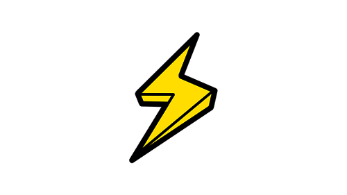

## About Me

I'm a Lacrosse Player, [Event Organizer](https://www.unchain-convention.com/), and Bitcoin Enthusiast ⚡

## Current Lacrosse Team

I run with [Victoria Lacrosse](http://www.victoria-lacrosse.com/), one of the first Lacrosse programs in Germany. 

Videos from our Games will be available [free on Youtube](https://www.youtube.com/playlist?list=PLQ56Yiu6lEaxIPm9-GB5M393CmtYRZFGY). Please we need more people to film our games, so feel free to contact me if anyone is down to help grow the game. 

## Bitcoin 
[Bits & Bolts](https://www.youtube.com/playlist?list=PLQ56Yiu6lEaw-oXyEnSjdLfqZSbWv2rrl) is a YouTube show about people building on Bitcoin.\n

[Burnt White Toast Podcast](http://burntwhitetoast.libsyn.com/episode-013-crypto-future-julian-and-leo) I appeared on this show way before I knew anything about what I was talking about. But its always nice to listen to what it sounded like in Dec. 2017
